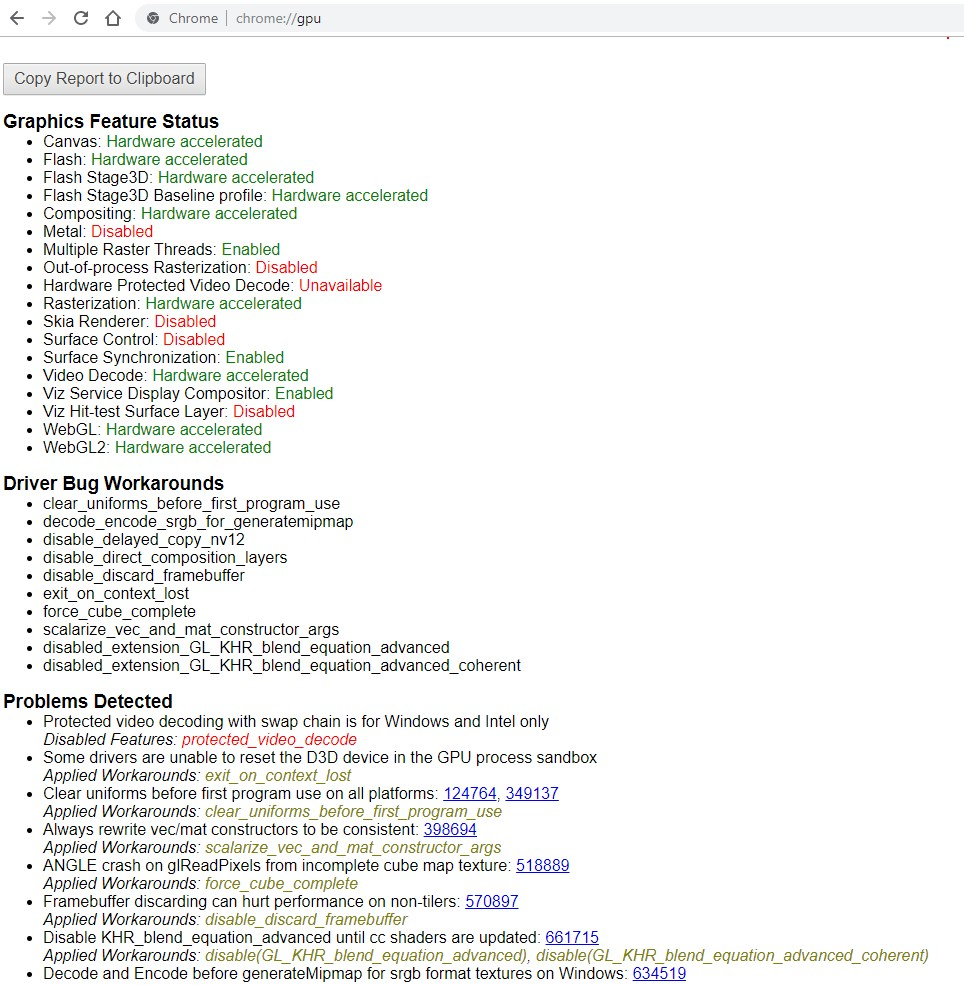
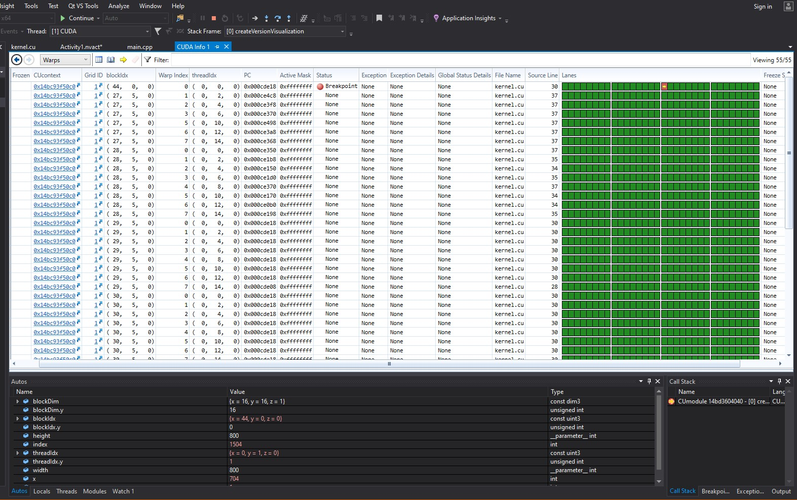

Project 0 Getting Started
====================

**University of Pennsylvania, CIS 565: GPU Programming and Architecture, Project 0**

Peyman Norouzi
* [LinkedIn](https://www.linkedin.com/in/peymannorouzi)
* Tested on: Windows 10, i7-6700 @ 3.40GHz 16GB, Quadro K620 2048MB (Moore 100C Lab)
* Cuda Compute Capability: 	5.0

Since I used Moore 100C Computers I wasn't able to complete DXR part of the assignment.

## Screenshots:

WebGL:

Cuda Window: 

Trace Timeline:

Nsight Debugging:

